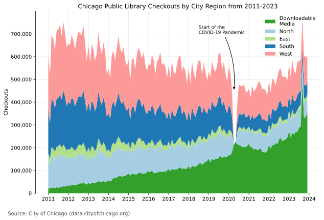
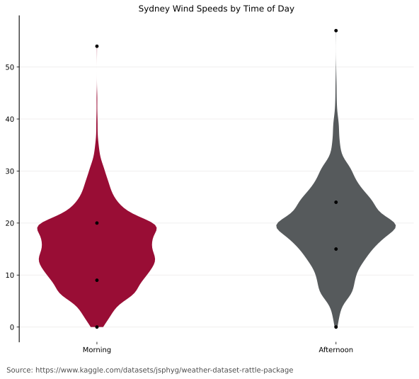

# Data Visualizations
This is a collection of multiple visualizations from multiple datasets.
# Chicago Public Libraries
## Dataset Information
This data was obtained from the City of Chicago. It contains information about the amount of books checked out and renewed in Chicago Public Libraries by branch. 

It was compiled with datasets corresponding to each year: 
[2023](https://catalog.data.gov/dataset/libraries-2023-circulation-by-location), 
[2022](https://catalog.data.gov/dataset/libraries-2022-circulation-by-location), 
[2021](https://catalog.data.gov/dataset/libraries-2021-circulation-by-location), 
[2020](https://catalog.data.gov/dataset/libraries-2020-circulation-by-location), 
[2019](https://catalog.data.gov/dataset/libraries-2019-circulation-by-location), 
[2018](https://catalog.data.gov/dataset/libraries-2018-circulation-by-location), 
[2017](https://catalog.data.gov/dataset/libraries-2017-circulation-by-location), 
[2016](https://catalog.data.gov/dataset/libraries-2016-circulation-by-location), 
[2015](https://catalog.data.gov/dataset/libraries-2015-circulation-by-location), 
[2014](https://catalog.data.gov/dataset/libraries-2014-circulation-by-location), 
[2013](https://catalog.data.gov/dataset/libraries-2013-circulation-by-location), 
[2012](https://catalog.data.gov/dataset/libraries-2012-circulation-by-location), 
[2011](https://catalog.data.gov/dataset/libraries-2011-circulation-by-location), 
[2010](https://catalog.data.gov/dataset/libraries-2010-circulation-by-location)

## Visualizations
### Wind Speeds and Directions in the City of Sydney

# Sydney Weather
## Dataset Information
This data was obtained from [Rain in Australia](https://www.kaggle.com/datasets/jsphyg/weather-dataset-rattle-package?resource=download&select=weatherAUS.csv). The data is copyrighted by the Australian Bureau of Meteorology, and collected by Joe Young. 
## Visualizations

